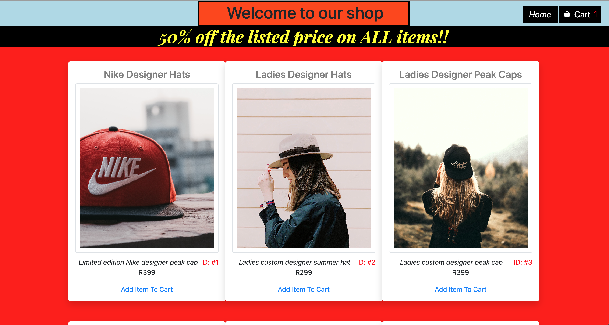
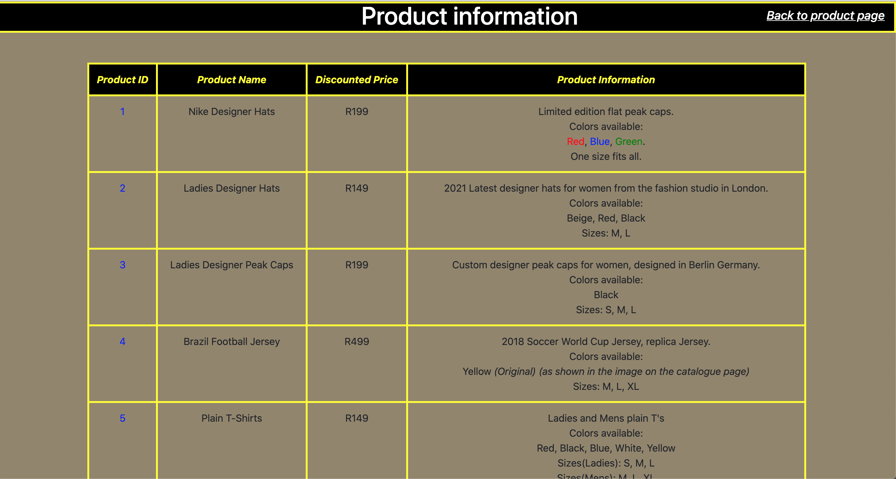
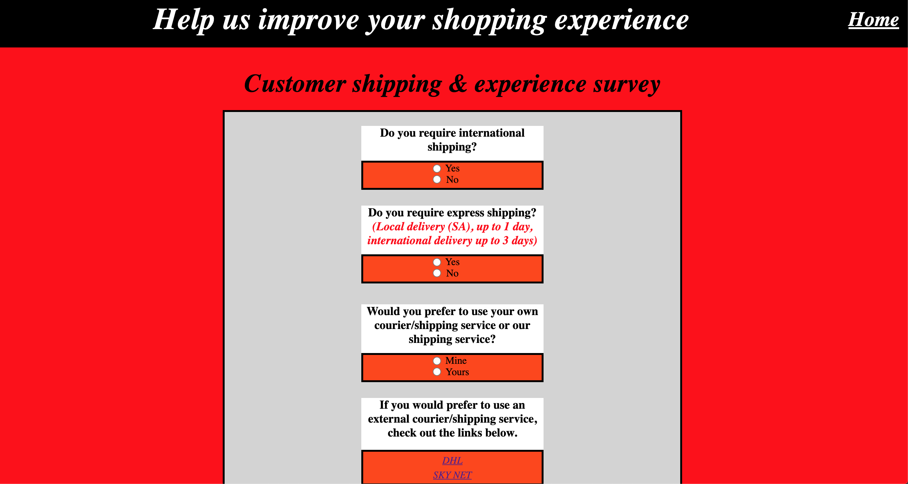
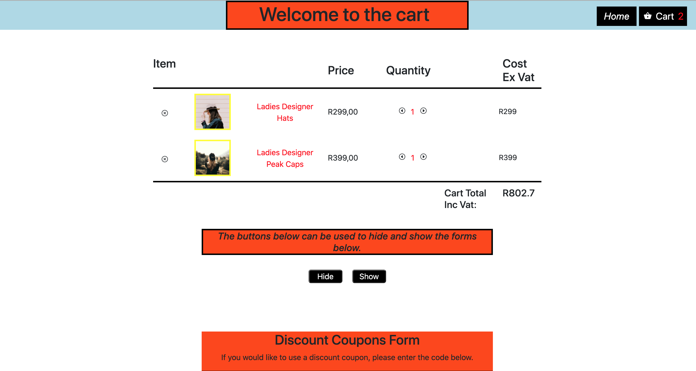

<a name="title"></a>

# Buyers Paradise Online Shop

<a name="description"></a>

## Project description

`This project is an online store that I have created that sells clothes and shoes for Women and Men.`

`Users are able to add products to a shopping cart and check what their total basket cost is. Users are also able to check information relating to the products that are for sale.`

<a name="contents"></a>

# Table of contents

- [Project name](#title)
- [Project description](#description)
- [Table contents](#contents)
- [Installation](#installation)
- [Usage](#usage)
  - [Screenshots]()

<a name="installation"></a>

# Installation

#### Step 1

```bash
    Open your terminal
    cd "your-projects-folder"
```

#### Step 2

```bash
git clone https://github.com/LukeG91/Buyers-Paradise-Online-Store.git
```

#### Step 3

```bash
Open VS code or the code editor that you use and open the project folder that you just downloaded.
```

#### Step 4

```bash
If you are using VS code, right click on the index.html file and select the "open with live server".  If you do not have the Live Server extension installed, you can follow the link below which shows how to install extensions in VS code.

https://code.visualstudio.com/docs/editor/extension-gallery
```

<a name="usage"></a>

# Usage

`The screenshots below displays the different pages on the website and how to interact with the web page.`

<a name="screenshots"></a>

# Screenshots

#### Home page


#### Catalogue page



#### Product information page



#### Customer experience/shipping page



#### Our story


#### Shopping cart


